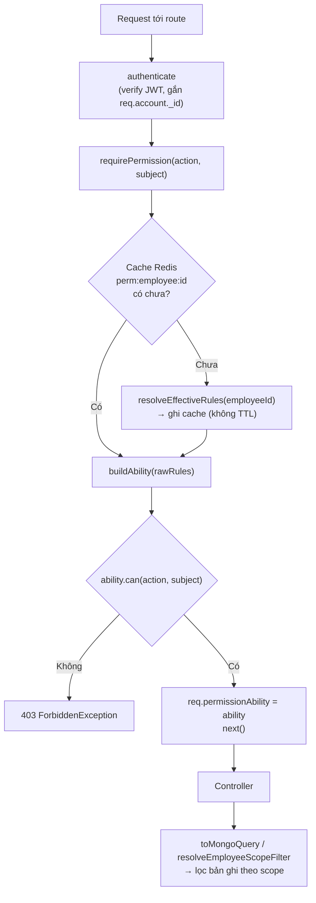
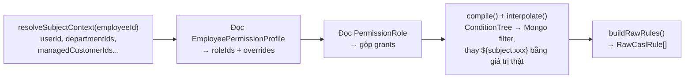

# Hệ thống phân quyền ABAC/CASL — Cơ chế đầy đủ

> Về bản chất đây là **ABAC (Attribute-Based Access Control)** dựng trên [CASL](https://casl.js.org/), không phải RBAC thuần — role chỉ là 1 "túi" gom permission, đơn vị kiểm tra quyền cuối cùng là bộ ba **`(action, subject, condition)`**.

Tài liệu này chỉ nói về hệ phân quyền **mới** — không nói về field cũ (`role`/`module_access`/`dept_scope`) hay RBAC cũ của module `request`/`kpi`. Lịch sử quyết định thiết kế xem `docs/PERMISSION-MODULE-PLAN.md`.

---

## Sơ đồ tổng quan



**2 tầng check tách biệt, đừng nhầm lẫn:**

| Tầng | Trả lời câu hỏi | Nơi thực hiện |
|---|---|---|
| **Route middleware** | "Được làm hành động này không?" (thô, không quan tâm bản ghi cụ thể) | `requirePermission()` |
| **Controller** | "Được thấy/sửa **bản ghi nào**?" | `toMongoQuery()` / `resolveEmployeeScopeFilter()` |

---

## 1. Data model — 6 collection Mongo

Tất cả nằm trong `src/models/`, kế thừa `BaseSchema` (soft-delete `isDeleted`).

| Collection | Vai trò |
|---|---|
| `permission_catalog` | Danh mục permission, seed sẵn, đọc-only. `{code, module, entity, actionKind, validDataScopePolicies[]}` |
| `data_scope_policy` | Quy tắc lọc dữ liệu theo entity. `{code, entity, conditionTree}` — `conditionTree: null` = không lọc (toàn công ty) |
| `field_scope_policy` | Whitelist field đọc/ghi — **hạ tầng đã có, chưa policy thật nào dùng** |
| `entity_attribute_catalog` | Whitelist đường dẫn field hợp lệ (`resource.xxx`, `subject.xxx`) cho từng entity |
| `permission_role` | Role = danh sách grant. `{code, grants: [{permissionCode, dataScopePolicyCode}]}` |
| `employee_permission_profile` | Gán role cho 1 nhân viên. `{employeeId, roleIds[], overrides[]}` — `employeeId` = `UserInfo._id`, **không phải** `Account._id` |

> **Nhiều role cùng lúc:** 1 nhân viên có thể giữ nhiều role — quyền gộp theo kiểu **OR** (role nào phạm vi rộng hơn thắng), riêng `overrides.status: BLOCK` luôn thắng tuyệt đối.

**Ví dụ 1 grant thật** (role `CRM_SALE`):
```json
{ "permissionCode": "customer.view", "dataScopePolicyCode": "CUSTOMER_SELF_ASSIGNED" }
```

---

## 2. Nơi check quyền hành động — `requirePermission()`

**File:** `src/core/authorization/require-permission.middleware.ts:44-61`

```js
router.get("/getUsers", authenticate, requirePermission("employee.view", "Employee"), UserController.getUsers);
```

| Dòng | Việc làm |
|---|---|
| 50 | `resolveEmployeeId(req.account._id)` → map account → `UserInfo._id` |
| 51 | `loadRules(employeeId)` — đọc cache Redis, miss thì gọi `resolveEffectiveRules()` |
| 52 | `buildAbility(rawRules)` — dựng CASL `Ability` |
| **54** | **`ability.can(action, subject)` — dòng check quyền thật sự** |
| 58 | Đúng → gắn `req.permissionAbility = ability`, `next()`. Sai → `ForbiddenException` (403) |

`req.permissionAbility` chỉ mang ý nghĩa "được làm hành động này" — **không tự lọc bản ghi**, việc đó thuộc về controller (mục 4).

---

## 3. Nơi build rule quyền — `resolveEffectiveRules()`

**File:** `src/modules/permission/application/resolve-effective-ability.service.ts:63-193`



- **`subject.xxx` lấy từ đâu:** `resolveSubjectContext()` (dòng 29-61) query 1 lần: `userId`, `accountId`, `departmentIds`, `departmentColleagueUserIds` (đồng nghiệp cùng phòng ban), `managedCustomerIds` (khách hàng do chính mình giới thiệu), `departmentColleagueCustomerIds`.
- **Compile điều kiện:** `condition-compiler.service.ts:70` (`compile()`) đổi `ConditionTree` tĩnh → Mongo operator (`$eq`/`$in`...), rồi `condition-compiler.service.ts:121` (`interpolate()`) thay `${subject.xxx}` bằng giá trị thật.
- **Gộp rule:** `ability-rule-builder.service.ts:65-78` (`buildRawRules()`) gộp grant + override (ALLOW/BLOCK) thành `RawCaslRule[]` — đây chính là thứ được cache.

---

## 4. Nơi lọc dữ liệu theo bản ghi — Data Scope

Hai helper dùng trong controller, cả hai đọc `req.permissionAbility`:

| Helper | File | Dùng khi nào |
|---|---|---|
| `toMongoQuery(ability, action, entity)` | `src/modules/permission/infrastructure/casl-ability.factory.ts:29-35` | Entity thường — trả thẳng Mongo filter (`accessibleBy` của `@casl/mongoose`) |
| `resolveEmployeeScopeFilter(ability, action)` | `src/core/authorization/resolve-employee-scope-filter.ts` | Riêng entity `Employee` — vì `UserInfoModel` không có field `departmentId` trực tiếp, phải tự "$lookup" qua `UserDepartmentPositionModel` rồi mới ra `_id: {$in: [...]}` |

**Ví dụ thật** — `UserController.getUsers`:

```js
const scopeFilter = await resolveEmployeeScopeFilter(req.permissionAbility, "employee.view");
if (Object.keys(scopeFilter).length > 0) scopeConditions.push(scopeFilter);
filter.$and = scopeConditions;
const users = await UserInfoModel.find(filter)...
```

**Check quyền sửa 1 bản ghi cụ thể** — nhúng filter vào query, không fetch-rồi-check:

```js
const updateScopeFilter = await resolveEmployeeScopeFilter(req.permissionAbility, "employee.update");
const allowed = await UserInfoModel.exists({ $and: [{ _id: targetId }, updateScopeFilter] });
if (!allowed) return res.status(403)...
```

> **Vì sao không dùng `ability.can()` trên document đã fetch sẵn:** có bug xác nhận khi `conditions` chứa `$and`/`$or` lồng nhau ở top-level (`docs/PERMISSION-MODULE-PLAN.md` mục 0). Luôn nhúng filter vào query DB.

**Field Scope** (`maskFields`, `assertAllowedFields` — `casl-ability.factory.ts:39-64`): hạ tầng đã viết xong nhưng **chưa có policy thật + chưa controller nào gọi tới**.

---

## 5. Cache Redis — nơi hay gây "quyền không cập nhật"

**Key:** `` `${BASE_URL}:perm:employee:{employeeId}` `` — `src/core/authorization/permission-cache-key.ts`

> **Không có TTL.** Rule đã cache tồn tại vô thời hạn tới khi bị xoá chủ động.

**Tự động xoá cache khi nào** — `src/modules/permission/application/handlers/invalidate-permission-cache.handler.ts`:

| Sự kiện | Bắn khi | Xoá cache của |
|---|---|---|
| `RoleDeletedDomainEvent` | Xoá 1 role | Mọi nhân viên đang giữ role đó |
| `RoleGrantsChangedDomainEvent` | Sửa `grants` của role (`PATCH /permissions/roles/:id`) | Mọi nhân viên giữ role đó (query lại lúc xử lý event) |
| `EmployeePermissionUpdatedDomainEvent` | Đổi role/override của 1 nhân viên (`PUT /permissions/employees/:employeeId`) | Đúng nhân viên đó |
| `DataScopePolicyChangedDomainEvent` / `FieldScopePolicyChangedDomainEvent` | Sửa `conditionTree` của 1 policy | Mọi nhân viên có role tham chiếu policy đó |

> **Cạm bẫy:** sửa quyền bằng cách **chạy lại script seed** (ghi thẳng DB) thì **không event nào được bắn** → cache cũ không tự xoá → phải tự quét `perm:employee:*` trên Redis và xoá tay.

---

## 6. Frontend — ẩn/hiện phần tử theo quyền

**Hook:** `useMyPermissions()` (`website-crm/src/features/permission/hooks/useMyPermissions.js`) → gọi `GET /permissions/me` → `{permissions: string[], canAny(codes), isLoading}`.

6 quy tắc áp dụng cho mọi màn có gate quyền:

1. Phần tử hiển thị dữ liệu → gate bằng đúng permission **"view"** của đúng resource, không suy luận qua permission khác.
2. Hành động sửa/ghi → gate bằng đúng permission **"write" cho đúng bản ghi đó** — ưu tiên field đã tính theo scope (vd `can_edit` từ backend) hơn "có permission code" chung chung.
3. Khối cần cả xem lẫn sửa → phải đủ **cả 2 quyền** mới hiện phần sửa.
4. Không có quyền → **ẩn hẳn**, không hiện placeholder/giải thích.
5. Không gọi API nếu biết trước sẽ 403 — dùng `enabled` của React Query.
6. Cha không còn phần tử con nào để hiện → **ẩn luôn cả khối cha**.

---

## 7. Seed — nạp dữ liệu quyền vào DB

```
npx ts-node --transpile-only scripts/seedPermissionAll.ts
```

Idempotent — chạy lại bao nhiêu lần cũng an toàn. Thứ tự phụ thuộc thật:

| # | Script | Nội dung |
|---|---|---|
| 1 | `seedPermissionCatalog.ts` | Danh mục permission |
| 2 | `seedPermissionDataScopePolicy.ts` | Data Scope Policy |
| 3 | `seedPermissionEntityAttributeCatalog.ts` | Whitelist field |
| 4 | `seedPermissionAdminRole.ts` | Role `PERMISSION_ADMIN`, tự gán cho `role: "admin"` |
| 5 | `seedPermissionCrmRoles.ts` | `CRM_SALE`, `CRM_SALE_MANAGER`, `CRM_SALE_TEAM_LEAD` |
| 6 | `seedPermissionEmployeeBaselineRole.ts` | `EMPLOYEE_BASELINE` |
| 7 | `seedPermissionHrmStaffRole.ts` | `HRM_STAFF` |
| 8 | `seedPermissionHrmManagerRole.ts` | `HRM_MANAGER` |
| 9 | `seedPermissionDeptManagerHrmWorkplaceRole.ts` | `DEPT_MANAGER_HRM_WORKPLACE` |
| 10 | `seedPermissionWorkplaceManagerRole.ts` | Role quản lý Workplace |

Chỉ sửa 1 role → chạy riêng script đó là đủ, nhưng **nhớ xoá cache Redis thủ công** sau đó (mục 5).
